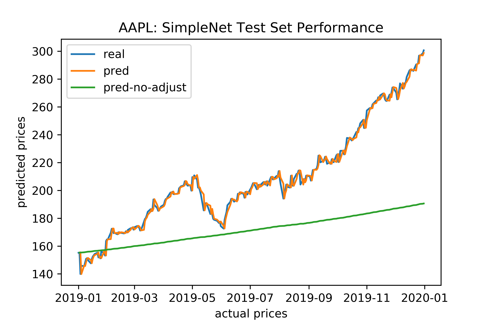
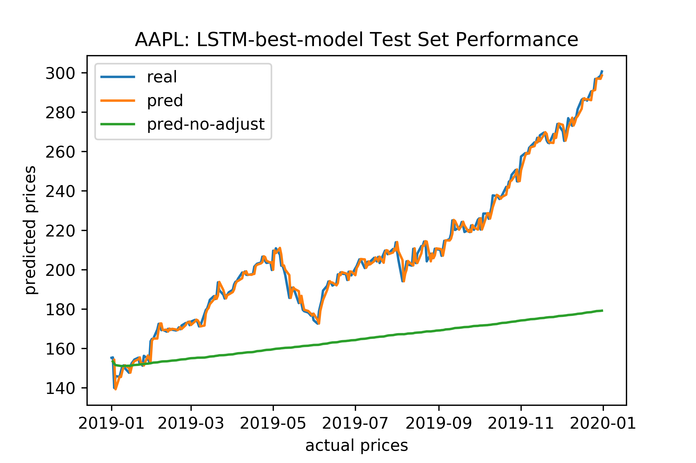

# Stock-Price-Indicator

This project uses machine learning / deep learning models to try to predict the prices of APPLE stocks. I will first use a very simple neural network and then use LSTM, tune the models and try to see whether the prediction performance can be increased.

## Project Overview

Investment firms, hedge funds and even individuals have been using financial models to better understand market behavior and make profitable investments and trades. Machine learning engineers and fund managers are therefore working together to find financials model that can properly describe the behaviors of the stock markets.

However, statistical analysts once argued and (some of the researchers) proved empirically that stock returns (especially in U.S. Equity markets) are weak-form efficient. Therefore, historical prices bear no information on future stock price movements. They argued that stock prices are unpredictable martingale processes. 

Recent rises in big data analysis, machine learning and deep learning have brought us to new horizons. With proper usage of these algorithms, we can probably be able to find reasonable models that can indicate the movement of stock prices.

I will not simply model the prices of the stocks because it has been observed that stock prices are empirically not stationary process and linear regression on the prices against explanatory variables are likely spurious. The machine learning models associated with these problems are likely to be spurious as well.

**A more reasonable approach is to predict the stock returns instead of the prices.** Stock returns are empirically proved to be stationary processes and therefore reasonable linear regression can be modeled. Complex machine learning and deep learning models can also be implemented. An extra benefit of stock return is stock returns are normalized to some number close to zero, while stock prices have different scales for each stock throughout the times. Throughout the analysis, I will use MSE as the loss function to train the returns of stock prices.

## Problem Statement

* Use machine learning / deep learning models to build the stock returns against a list of explanatory variables, each of them properly normalized.

* Analyze the stock price (return) predictability among the provided factors.

* Hyperparameter Tuning.

* Deploy the model, such that users can get the prediction of price movements tomorrow.

## Requirements

* pandas data-reader:

  `conda install -c anaconda pandas-datareader`
  
* Environment: SageMaker with PyTorch36

## Data

I use the following three datasets to retrieve data and perform analysis:

*	[Yahoo Finance](https://finance.yahoo.com/): Web API are used to get the stock prices.

*	[FRED](https://fred.stlouisfed.org/): Web API are used to get the economic data. For example, interest rates, dollar index, etc.

*	[Professor Kenneth R. French's Website](http://mba.tuck.dartmouth.edu/pages/faculty/ken.french/): Fama-French factor models used Fama-French factors. The up-to-date factors are freely available in the website.

## Conclusion In Short

### 1. Data Preprocessing

First, I read the data, then merge and normalize the data with the following steps (show in Step1_Data_Processing.ipynb):

1. Normalize Open / High / Low / Close / Adjusted Close and retain information by: calculating returns (returns of adjusted close) / returns in day (returns in the day, in terms of open and close) / range ratio in the day (high - low / open)

2. Normalize Volume = log( log( volume + 1) + 1). In some cases, if the volume of that day is 0, we just do not remove this data. In this case, the new volume is still 0.

3. Normalize 12-Month London Interbank Offered Rate (LIBOR), based on U.S. Dollar (USD12MD156N): divide by 100 to get the real value (percentage)

4. Normalize Trade Weighted U.S. Dollar Index: Major Currencies, Goods; Index Mar 1973=100, Not Seasonally Adjusted (DTWEXM): DTWEXM (new) = (DTWEXM - 100) / 100: 100 is like the benchmark index

5. Normalize Moody's Seasoned Aaa Corporate Bond Yield, Percent, Not Seasonally Adjusted (DAAA): divide by 100 to get the real value (percentage)

6. Normalize VIXCLS (CBOE Volatility Index: VIX; Index, Not Seasonally Adjusted): divide by 100 to get the real value (percentage)

7. Normalize The Fama-French Five Factor Model data (Mkt-RF, SMB, HML, RMW and CMA): divide by 100 to get the real value (percentage)

Here is a brief introduction of some of the recent data:

As can be shown, AAPL_retNext is the returns of the next date (today's price against tomorrow's price), AAPL_ret is the returns now (today's price against yesterday's price). The first column is what we want to predict, `y`. The other columns are explainatory variables.

| Date       | AAPL_retNext | AAPL_ret | AAPL_loglogVol | USD12MD156N | DTWEXM | Mkt-RF | SMB    | HML    |
|------------|--------------|----------|----------------|-------------|--------|--------|--------|--------|
| 2019/12/25 | 1.98%        | 0.10%    | 285.13%        | 2.01%       | -7.95% | 0.01%  | 0.36%  | -0.07% |
| 2019/12/26 | -0.04%       | 1.98%    | 288.83%        | 2.01%       | -8.08% | 0.49%  | -0.56% | 0.00%  |
| 2019/12/27 | 0.59%        | -0.04%   | 291.31%        | 2.00%       | -8.54% | -0.09% | -0.54% | -0.07% |
| 2019/12/30 | 0.73%        | 0.59%    | 291.23%        | 2.00%       | -8.86% | -0.57% | 0.27%  | 0.58%  |
| 2019/12/31 | 0.73%        | 0.73%    | 289.27%        | 2.00%       | -9.18% | 0.28%  | 0.02%  | 0.14%  |

Descriptive statistics:

|                 | mean    | std    | min     | 25%     | 50%     | 75%    | max    | max      |
|-----------------|---------|--------|---------|---------|---------|--------|--------|----------|
| AAPL_retNext    | 0.13%   | 2.52%  | -51.87% | -1.02%  | 0.09%   | 1.28%  | 13.90% | 0.139049 |
| AAPL_ret        | 0.12%   | 2.52%  | -51.87% | -1.02%  | 0.09%   | 1.28%  | 13.90% | 0.139049 |
| AAPL_loglogVol  | 2.96    | 0.04   | 2.84    | 2.93    | 2.96    | 2.99   | 3.11   | 3.10644  |
| AAPL_retInday   | 0.03%   | 2.06%  | -12.00% | -0.97%  | 0.03%   | 1.00%  | 13.13% | 0.131278 |
| AAPL_rangeRatio | 2.86%   | 2.01%  | 0.41%   | 1.49%   | 2.29%   | 3.57%  | 23.24% | 0.232439 |
| Other Stocks    |         |        |         | ...     |         |        |        |          |
| USD12MD156N     | 2.43%   | 1.77%  | 0.53%   | 1.02%   | 1.81%   | 3.23%  | 7.50%  | 0.075012 |
| DTWEXM          | -14.02% | 10.94% | -31.99% | -23.74% | -14.76% | -7.78% | 13.10% | 0.130952 |
| DAAA            | 5.00%   | 1.19%  | 2.81%   | 3.94%   | 5.11%   | 5.67%  | 8.12%  | 0.0812   |
| VIXCLS          | 19.47%  | 8.45%  | 9.14%   | 13.48%  | 17.30%  | 22.90% | 80.86% | 0.8086   |
| Mkt-RF          | 0.03%   | 1.20%  | -8.95%  | -0.48%  | 0.07%   | 0.58%  | 11.35% | 0.1135   |
| SMB             | 0.01%   | 0.59%  | -4.31%  | -0.32%  | 0.02%   | 0.35%  | 4.49%  | 0.0449   |
| HML             | 0.01%   | 0.66%  | -4.24%  | -0.29%  | 0.00%   | 0.28%  | 4.83%  | 0.0483   |
| RMW             | 0.02%   | 0.51%  | -2.92%  | -0.23%  | 0.01%   | 0.25%  | 4.40%  | 0.044    |
| CMA             | 0.01%   | 0.42%  | -5.94%  | -0.19%  | 0.00%   | 0.20%  | 2.41%  | 0.0241   |
| RF              | 0.01%   | 0.01%  | 0.00%   | 0.00%   | 0.00%   | 0.01%  | 0.03%  | 0.00026  |

Then, I will split the dataset. The training set will be 95% of the data (from 2000/01/01 to 2018/12/31). The test set will be the remaining 1 year data from 2019/01/01 to 2019/12/31. This is reasonable because it's unlikely that a stock predicting model will survive more than 1 year, empirically speaking.

### 2. Training Simple Neural Network

Using the data created from Step 1, here we are going to build a simple benchmark model (simple neural network) to evaluate the stock return predictability.

The class of the simple neural network model is defined as follows. It has three layers: input layer, hidden layer and output layer. It feeds input data to sigmoid activated hidden layer, converts it to from -1 to 1 to match up with the RMSE loss function and the fact that returns are normally scaled from -1 to 1. Then it transform the hidden layer to the output layer without further activation.

```
import torch
import torch.nn as nn
import torch.nn.functional as F

class SimpleNet(nn.Module):

    def __init__(self, input_dim, hidden_dim, output_dim):
        '''Defines layers of a neural network.
           :param input_dim: Number of input features
           :param hidden_dim: Size of hidden layer(s)
           :param output_dim: Number of outputs
         '''
        super(SimpleNet, self).__init__()
        # defining 2 linear layers
        self.fc1 = nn.Linear(input_dim, hidden_dim)
        self.fc2 = nn.Linear(hidden_dim, output_dim)
        self.drop = nn.Dropout(0.1)
        self.sig = nn.Sigmoid()

    def forward(self, x):
        '''Feedforward behavior of the net.
           :param x: A batch of input features
           :return: A single real value
        '''
        out = self.fc1(x)
        out = self.sig(out)
        # convert to from -1 to 1
        out = 2 * out - 1
        out = self.drop(out)
        out = self.fc2(out)
        return out
```

The codes for training are as follows:

```
from __future__ import print_function  # future proof
import argparse
import sys
import os
import json

import pandas as pd

# pytorch
import torch
import torch.nn as nn
import torch.optim as optim
import torch.utils.data

# import model
from model import SimpleNet

def model_fn(model_dir):
    print("Loading model.")

    # First, load the parameters used to create the model.
    model_info = {}
    model_info_path = os.path.join(model_dir, 'model_info.pth')
    with open(model_info_path, 'rb') as f:
        model_info = torch.load(f)

    print("model_info: {}".format(model_info))

    # Determine the device and construct the model.
    device = torch.device("cuda" if torch.cuda.is_available() else "cpu")
    model = SimpleNet(model_info['input_dim'],
                      model_info['hidden_dim'],
                      model_info['output_dim'])

    # Load the stored model parameters.
    model_path = os.path.join(model_dir, 'model.pth')
    with open(model_path, 'rb') as f:
        model.load_state_dict(torch.load(f))

    return model.to(device)


# Load the training data from a csv file
def _get_train_loader(batch_size, data_dir):
    print("Get data loader.")

    # read in csv file
    train_data = pd.read_csv(os.path.join(data_dir, "train.csv"), header=None)

    # labels are first column
    train_y = torch.from_numpy(train_data[[0]].values).float().squeeze()
    # features are the rest
    train_x = torch.from_numpy(train_data.drop([0], axis=1).values).float()

    # create dataset
    train_ds = torch.utils.data.TensorDataset(train_x, train_y)

    return torch.utils.data.DataLoader(train_ds, batch_size=batch_size)


# Provided train function
def train(model, train_loader, epochs, optimizer, criterion, device):
    """
    This is the training method that is called by the PyTorch training script. The parameters
    passed are as follows:
    model        - The PyTorch model that we wish to train.
    train_loader - The PyTorch DataLoader that should be used during training.
    epochs       - The total number of epochs to train for.
    optimizer    - The optimizer to use during training.
    criterion    - The loss function used for training.
    device       - Where the model and data should be loaded (gpu or cpu).
    """

    for epoch in range(1, epochs + 1):
        model.train()
        total_loss = 0
        for batch_idx, (data, target) in enumerate(train_loader, 1):
            # prep data
            data, target = data.to(device), target.to(device)
            optimizer.zero_grad()  # zero accumulated gradients
            # get output of SimpleNet
            output = model(data)
            # calculate loss and perform backprop
            loss = criterion(output, target)
            loss.backward(retain_graph=True)
            # loss.backward()
            optimizer.step()

            total_loss += loss.item()

        # print loss stats
        print("Epoch: {}, Loss: {}".format(epoch, total_loss / len(train_loader)))

    # save trained model, after all epochs
    save_model(model, args.model_dir)
    return model


# Provided model saving functions
def save_model(model, model_dir):
    print("Saving the model.")
    path = os.path.join(model_dir, 'model.pth')
    # save state dictionary
    torch.save(model.cpu().state_dict(), path)


def save_model_params(model, model_dir):
    model_info_path = os.path.join(args.model_dir, 'model_info.pth')
    with open(model_info_path, 'wb') as f:
        model_info = {
            'input_dim': args.input_dim,
            'hidden_dim': args.hidden_dim,
            'output_dim': args.output_dim
        }
        torch.save(model_info, f)


if __name__ == '__main__':
    # All of the model parameters and training parameters are sent as arguments
    # when this script is executed, during a training job

    # Here we set up an argument parser to easily access the parameters
    parser = argparse.ArgumentParser()

    # SageMaker parameters, like the directories for training data and saving models; set automatically
    # Do not need to change
    try:
        sm_host = json.loads(os.environ['SM_HOSTS'])
    except:
        sm_host = []
    try:
        current_host = os.environ['SM_CURRENT_HOST']
    except:
        current_host = ""
    try:
        model_dir = os.environ['SM_MODEL_DIR']
    except:
        model_dir = ""
    try:
        data_dir = os.environ['SM_CHANNEL_TRAIN']
    except:
        data_dir = ""

    parser.add_argument('--hosts', type=list, default=sm_host)
    parser.add_argument('--current-host', type=str, default=current_host)
    parser.add_argument('--model-dir', type=str, default=model_dir)
    parser.add_argument('--data-dir', type=str, default=data_dir)

    # Training Parameters, given
    parser.add_argument('--batch-size', type=int, default=64, metavar='N',
                        help='input batch size for training (default: 64)')
    parser.add_argument('--epochs', type=int, default=100, metavar='N',
                        help='number of epochs to train (default: 10)')
    parser.add_argument('--lr', type=float, default=0.001, metavar='LR',
                        help='learning rate (default: 0.001)')
    parser.add_argument('--seed', type=int, default=10000, metavar='S',
                        help='random seed (default: 1)')

    # Model parameters
    parser.add_argument('--input_dim', type=int, default=46, metavar='IN',
                        help='number of input features to model (default: 2)')
    parser.add_argument('--hidden_dim', type=int, default=10, metavar='H',
                        help='hidden dim of model (default: 20)')
    parser.add_argument('--output_dim', type=int, default=1, metavar='OUT',
                        help='output dim of model (default: 1)')

    args = parser.parse_args()

    device = torch.device("cuda" if torch.cuda.is_available() else "cpu")

    # set the seed for generating random numbers
    torch.manual_seed(args.seed)
    if torch.cuda.is_available():
        torch.cuda.manual_seed(args.seed)

    # get train loader
    train_loader = _get_train_loader(args.batch_size, args.data_dir)  # data_dir from above..

    # To get params from the parser, call args.argument_name, ex. args.epochs or ards.hidden_dim
    # Don't forget to move your model .to(device) to move to GPU , if appropriate
    model = SimpleNet(args.input_dim, args.hidden_dim, args.output_dim).to(device)

    # Given: save the parameters used to construct the model
    save_model_params(model, args.model_dir)

    optimizer = optim.Adam(model.parameters(), lr=args.lr)
    criterion = nn.MSELoss()

    # Trains the model (given line of code, which calls the above training function)
    # This function *also* saves the model state dictionary
    train(model, train_loader, args.epochs, optimizer, criterion, device)
```

The training codes are able to be run directly in your local computer. But you may need to specify the arguments by your own. I used AWS SageMaker to directly run the train.py codes smoothly (as seen in my jupyter notebook: Step2_Train_SimpleNet.ipynb). The training process costs less than 1 minute.

After training, I used the test-set to check out the performance of prediction:



The blue line is the actual prices. The orange line is the predicted prices, given that I use the returns that I predict times the prices given last day. The green line is the predicted prices, given that I use the returns that I predict times the prices that I predicted the last date. The orange line is more realistic because during prediction, we will certainly know today's prices. The green line is demonstrated to show that our prediction is accurate generally in the direction of price movements.

The return accuracy (in terms of directions) is `57.85%` and RMSE is `1.630%`, indicating that our model predicts `57.85%` times correct, and the predicted returns have generally a standard deviation of 1.63%. Given that unknown stock price volatility can be some number around this `1.63%`, the simple neural network might be a good model enough.

Then, let's check out whether a more complicated LSTM will improve the performance.

### 3. Training a LSTM Model

Long short-term memory (LSTM) is an artificial recurrent neural network (RNN) architecture used in the field of deep learning. Unlike standard feedforward neural networks, LSTM has feedback connections. It can not only process single data points (such as images), but also entire sequences of data (such as speech or video). For example, LSTM is applicable to tasks such as unsegmented, connected handwriting recognition, speech recognition and anomaly detection in network traffic or IDS's (intrusion detection systems).[1](https://en.wikipedia.org/wiki/Long_short-term_memory)

Stock data are like sequence data: it's a time-series. However, unlike audio, images or verbals, past prices do not depend on the future prices. Therefore, a uni-directional LSTM should be enough for modeling. Except from the single sequence of stock prices, we can also incorporate the other features to get the final output.

The structure of my LSTM model is more than a simple LSTM layer:

1. Input layer -> feature layer: This is a linear layer. I will linearly transform the input data to some lower dimensional feature data. This is because LSTM training is costly, and our original data may contain some useless information. Other methods, like PCA can be implemented but since the features of our model are not really large (only about 46), we do not bother using PCA.

2. Feature layer -> LSTM layer (hidden layer): This is the primary cost of everything. LSTM layer (hidden layer) will use the LSTM layer (hidden layer) from the last term, and forecast the new LSTM layer. Error back propagation will also be implemented iteratively.

3. LSTM layer (hidden layer) -> output layer. LSTM layer will predict the same dimensional information as the hidden layer dimension. So I will only use a simple dropout and linear transform to get the final data.

The model is defined as the following codes:

```
import torch
import torch.nn as nn
import torch.nn.functional as F

# Here we define our model as a class
class SimpleLSTM(nn.Module):
    def __init__(self, input_dim, feature_dim, hidden_dim, output_dim):
        super().__init__()

        self.feature_dim = feature_dim
        self.fc1 = nn.Linear(input_dim, self.feature_dim)

        self.hidden_layer_size = hidden_dim
        self.lstm = nn.LSTM(self.feature_dim, hidden_dim)
        self.hidden_cell = (torch.zeros(1, 1, self.hidden_layer_size),
                            torch.zeros(1, 1, self.hidden_layer_size))

        self.drop = nn.Dropout(0.1)
        self.fc2 = nn.Linear(hidden_dim, output_dim)


    def forward(self, input_seq):

        out = input_seq.view(len(input_seq), 1, -1)
        out = self.fc1(out)
        out = F.relu(out)
        out = self.drop(out)

        out, self.hidden_cell = self.lstm(out, self.hidden_cell)
        out = out.view(len(out), -1)
        out = self.drop(out)

        predictions = self.fc2(out)
        return predictions
```

The training codes are defined as follows:

```
from __future__ import print_function  # future proof
import argparse
import sys
import os
import json

import pandas as pd

# pytorch
import torch
import torch.nn as nn
import torch.optim as optim
import torch.utils.data

# import model
from model import SimpleLSTM

def model_fn(model_dir):
    print("Loading model.")

    # First, load the parameters used to create the model.
    model_info = {}
    model_info_path = os.path.join(model_dir, 'model_info.pth')
    with open(model_info_path, 'rb') as f:
        model_info = torch.load(f)

    print("model_info: {}".format(model_info))

    # Determine the device and construct the model.
    device = torch.device("cuda" if torch.cuda.is_available() else "cpu")
    model = SimpleLSTM(model_info['input_dim'],
                       model_info['feature_dim'],
                       model_info['hidden_dim'],
                       model_info['output_dim'])

    # Load the stored model parameters.
    model_path = os.path.join(model_dir, 'model.pth')
    with open(model_path, 'rb') as f:
        model.load_state_dict(torch.load(f))

    return model.to(device)


# Load the training data and validation data from a csv file
def _get_train_val_loader(batch_size, data_dir, validation_split):
    print("Get data loader.")

    # read in csv file
    data = pd.read_csv(os.path.join(data_dir, "train.csv"), header=None)
    
    split = int(data.shape[0] * (1 - validation_split))
    train_data = data[:split]

    # labels are first column
    train_y = torch.from_numpy(train_data[[0]].values).float().squeeze()
    # features are the rest
    train_x = torch.from_numpy(train_data.drop([0], axis=1).values).float()

    # create dataset
    train_ds = torch.utils.data.TensorDataset(train_x, train_y)
    
    if validation_split > 0:
        val_data = data[split:]
        # labels are first column
        val_y = torch.from_numpy(val_data[[0]].values).float().squeeze()
        # features are the rest
        val_x = torch.from_numpy(val_data.drop([0], axis=1).values).float()
        # create dataset
        val_ds = torch.utils.data.TensorDataset(val_x, val_y)
    else:    
        val_ds = None

    return (torch.utils.data.DataLoader(train_ds, batch_size=batch_size), val_ds)


# Provided train function
def train(model, train_loader, val_dataset, epochs, optimizer, criterion, device):
    """
    This is the training method that is called by the PyTorch training script. The parameters
    passed are as follows:
    model        - The PyTorch model that we wish to train.
    train_loader - The PyTorch DataLoader that should be used during training.
    val_dataset  - The PyTorch Tensor data-set that should be used in the validation
    epochs       - The total number of epochs to train for.
    optimizer    - The optimizer to use during training.
    criterion    - The loss function used for training.
    device       - Where the model and data should be loaded (gpu or cpu).
    """

    for epoch in range(1, epochs + 1):
        model.train()
        total_loss = 0
        for batch_idx, (data, target) in enumerate(train_loader, 1):
            # prep data
            data, target = data.to(device), target.to(device)
            optimizer.zero_grad()  # zero accumulated gradients
            # get output of SimpleLSTM
            output = model(data)
            # calculate loss and perform backprop
            loss = criterion(output, target)
            loss.backward(retain_graph=True)
            # loss.backward()
            optimizer.step()

            total_loss += loss.item()

        # print loss stats
        print("Epoch: {}, Loss: {}".format(epoch, total_loss / len(train_loader)))

        # print validation loss stats
        if val_dataset is not None:
            val_data, val_target = val_dataset.tensors
            val_output = model(val_data)
            val_loss = criterion(val_output, val_target)
            print("validation:rmse={}".format(val_loss / len(val_target)))

    # save trained model, after all epochs
    save_model(model, args.model_dir)

    return model


# Provided model saving functions
def save_model(model, model_dir):
    print("Saving the model.")
    path = os.path.join(model_dir, 'model.pth')
    # save state dictionary
    torch.save(model.cpu().state_dict(), path)


def save_model_params(model, model_dir):
    model_info_path = os.path.join(args.model_dir, 'model_info.pth')
    with open(model_info_path, 'wb') as f:
        model_info = {
            'input_dim': args.input_dim,
            'feature_dim': args.feature_dim,
            'hidden_dim': args.hidden_dim,
            'output_dim': args.output_dim
        }
        torch.save(model_info, f)


if __name__ == '__main__':
    # All of the model parameters and training parameters are sent as arguments
    # when this script is executed, during a training job

    # Here we set up an argument parser to easily access the parameters
    parser = argparse.ArgumentParser()

    # SageMaker parameters, like the directories for training data and saving models; set automatically
    # Do not need to change

    try:
        sm_host = json.loads(os.environ['SM_HOSTS'])
    except:
        sm_host = []
    try:
        current_host = os.environ['SM_CURRENT_HOST']
    except:
        current_host = ""
    try:
        model_dir = os.environ['SM_MODEL_DIR']
    except:
        model_dir = ""
    try:
        data_dir = os.environ['SM_CHANNEL_TRAIN']
    except:
        data_dir = ""

    parser.add_argument('--hosts', type=list, default=sm_host)
    parser.add_argument('--current-host', type=str, default=current_host)
    parser.add_argument('--model-dir', type=str, default=model_dir)
    parser.add_argument('--data-dir', type=str, default=data_dir)

    # Training Parameters, given
    parser.add_argument('--batch-size', type=int, default=64, metavar='N',
                        help='input batch size for training (default: 64)')
    parser.add_argument('--epochs', type=int, default=100, metavar='N',
                        help='number of epochs to train (default: 10)')
    parser.add_argument('--lr', type=float, default=0.001, metavar='LR',
                        help='learning rate (default: 0.001)')
    parser.add_argument('--seed', type=int, default=10000, metavar='S',
                        help='random seed (default: 1)')
    parser.add_argument('--validation_split', type=float, default=0, metavar='VS',
                        help='validation set splitting (default: 0), default NO spliting of validation set.')
    
    # Model parameters
    parser.add_argument('--input_dim', type=int, default=46, metavar='IN',
                        help='number of input features to model (default: 2)')
    parser.add_argument('--feature_dim', type=int, default=10, metavar='H',
                        help='feature dim of model (default: 10)')
    parser.add_argument('--hidden_dim', type=int, default=20, metavar='H',
                        help='hidden dim of model (default: 20)')
    parser.add_argument('--output_dim', type=int, default=1, metavar='OUT',
                        help='output dim of model (default: 1)')

    args = parser.parse_args()

    device = torch.device("cuda" if torch.cuda.is_available() else "cpu")

    # set the seed for generating random numbers
    torch.manual_seed(args.seed)
    if torch.cuda.is_available():
        torch.cuda.manual_seed(args.seed)

    # get train loader
    train_loader, val_dataset = _get_train_val_loader(args.batch_size,
                                                      args.data_dir, args.validation_split)  # data_dir from above..

    # To get params from the parser, call args.argument_name, ex. args.epochs or ards.hidden_dim
    # Don't forget to move your model .to(device) to move to GPU , if appropriate
    model = SimpleLSTM(args.input_dim, args.feature_dim, args.hidden_dim, args.output_dim).to(device)

    # Given: save the parameters used to construct the model
    save_model_params(model, args.model_dir)

    optimizer = optim.Adam(model.parameters(), lr=args.lr)
    criterion = nn.MSELoss()

    # Trains the model (given line of code, which calls the above training function)
    # This function *also* saves the model state dictionary
    train(model, train_loader, val_dataset, args.epochs, optimizer, criterion, device)

```

which is quite similar to the simple net training codes.

Beyond this, I used hyperparameter tuning to tune the models with hyperparameters (number of epochs, feature dim, hidden dim, and where the validation set splits) that perform the best (lowest RMSE) in the validation set.

I tried with 30 concurrent random hyperparameter tuning tasks and used AWS SageMaker to help me tune the hyperparameters. The tuned results are as follows:

| FinalObjectiveValue | TrainingElapsedTimeSeconds | epochs | feature_dim | hidden_dim | validation_split |
|---------------------|----------------------------|--------|-------------|------------|------------------|
| 1.95E-07            | 4581                       | 14     | 17          | 19         | 0.243            |
| 1.96E-07            | 5414                       | 15     | 15          | 25         | 0.247            |
| 1.99E-07            | 5179                       | 15     | 15          | 25         | 0.244            |
| 2.02E-07            | 5564                       | 15     | 14          | 23         | 0.237            |
| 2.07E-07            | 5230                       | 15     | 13          | 17         | 0.250            |
| 2.08E-07            | 2904                       | 11     | 18          | 23         | 0.236            |
| 2.30E-07            | 5503                       | 15     | 20          | 23         | 0.223            |
| 2.32E-07            | 5476                       | 15     | 5           | 11         | 0.211            |
| 2.50E-07            | 4630                       | 14     | 7           | 5          | 0.223            |
| 2.69E-07            | 5495                       | 15     | 24          | 22         | 0.201            |
| 2.90E-07            | 5353                       | 15     | 6           | 22         | 0.249            |
| 2.90E-07            | 5303                       | 15     | 6           | 22         | 0.248            |
| 3.12E-07            | 4456                       | 14     | 25          | 11         | 0.246            |
| 3.14E-07            | 4466                       | 14     | 25          | 11         | 0.244            |
| 3.34E-07            | 845                        | 6      | 25          | 24         | 0.235            |
| 3.67E-07            | 3080                       | 11     | 24          | 25         | 0.181            |
| 4.43E-07            | 4579                       | 13     | 21          | 11         | 0.108            |
| 4.72E-07            | 3983                       | 12     | 23          | 25         | 0.116            |
| 4.80E-07            | 5051                       | 14     | 19          | 7          | 0.142            |
| 5.13E-07            | 703                        | 5      | 25          | 20         | 0.115            |
| 5.84E-07            | 4469                       | 14     | 6           | 7          | 0.246            |
| 5.86E-07            | 4459                       | 14     | 6           | 7          | 0.247            |
| 7.69E-07            | 1441                       | 8      | 23          | 5          | 0.227            |
| 7.73E-07            | 1401                       | 8      | 23          | 5          | 0.226            |
| 7.93E-07            | 3207                       | 11     | 6           | 11         | 0.131            |
| 8.70E-07            | 1717                       | 8      | 6           | 21         | 0.104            |
| 8.88E-07            | 1772                       | 8      | 6           | 21         | 0.103            |
| 1.06E-06            | 845                        | 6      | 17          | 11         | 0.230            |
| 1.15E-06            | 3425                       | 12     | 10          | 6          | 0.211            |
| 1.19E-06            | 4277                       | 13     | 13          | 5          | 0.152            |

The best model is in the first row. The hyperparameters are (ignoring sagemaker-realted hyperparameters):

```
{'_tuning_objective_metric': 'validation:rmse',
 'epochs': '14',
 'feature_dim': '17',
 'hidden_dim': '19',
 'input_dim': '46',
 'output_dim': '1',
 'sagemaker_container_log_level': '20',
 'sagemaker_enable_cloudwatch_metrics': 'false',
 'sagemaker_estimator_class_name': '"PyTorch"',
 'sagemaker_estimator_module': '"sagemaker.pytorch.estimator"',
 'sagemaker_job_name': '"pytorch-training-2020-02-24-11-52-00-413"',
 'sagemaker_program': '"train.py"',
 'sagemaker_region': '"ap-northeast-1"',
 'sagemaker_submit_directory': '"s3://sagemaker-ap-northeast-1-165829362107/pytorch-training-2020-02-24-11-52-00-413/source/sourcedir.tar.gz"',
 'validation_split': 0}
```

Then, retrain the best model with the data of both train set and validation set using the best hyperparameters given above. The training process is logged as follows:

```
02:47:43
Epoch: 1, Loss: 0.0013985816122164042
02:49:10
Epoch: 2, Loss: 0.000815931344382429
02:51:36
Epoch: 3, Loss: 0.0007454148954144703
02:55:01
Epoch: 4, Loss: 0.0007118778092449363
04:27:54
Epoch: 5, Loss: 0.0006954010366312921
04:27:54
Epoch: 6, Loss: 0.0006843215195635238
04:27:54
Epoch: 7, Loss: 0.0006780958605164555
04:27:54
Epoch: 8, Loss: 0.0006762842923098316
04:27:54
Epoch: 9, Loss: 0.0006708226381959274
04:27:54
Epoch: 10, Loss: 0.0006682041561222062
04:27:54
Epoch: 11, Loss: 0.0006662942774150557
04:27:54
Epoch: 12, Loss: 0.0006642370652302932
04:27:54
Epoch: 13, Loss: 0.0006636403653455767
04:27:54
Epoch: 14, Loss: 0.0006615481683044122
```

The training errors are not decreasing much as epochs go further since 10. So the training process should be enough. Finally, we check out the test set to see the performance as follows:



The blue line is the actual prices. The orange line is the predicted prices, given that I use the returns that I predict times the prices given last day. The green line is the predicted prices, given that I use the returns that I predict times the prices that I predicted the last date. The orange line is more realistic because during prediction, we will certainly know today's prices. The green line is demonstrated to show that our prediction is accurate generally in the direction of price movements.

The return accuracy (in terms of directions) is `57.41%` and RMSE is `1.624%`, indicating that our model predicts `57.41%` times correct, and the predicted returns have generally a standard deviation of `1.624%`. Given that unknown stock price volatility can be some number around this `1.624%`, the LSTM might be a good model enough.

However, if we compare with the previous simple neural network results, the accuracy and RMSE does not change very much. LSTM is merely slightly better than the Simple Net. Even LSTM with hyperparameters tuned are no more better. The rmse of the test set only increased from `1.630%` to `1.624%`. The accuracy is slightly worse but very similar.

One improvement is, compared with Simple Net model, the LSTM model learnt slightly from the initial crash down (the first tiny drop-downs of the green plot) and learnt the subsequent market fevers for `AAPL` and predict that the prices should be increasing. This is in fact true, so LSTM model is slightly better.

In conclusion, **No complex machine learning or deep learning model can learn to predict the noisy financial market. The martingale hypothesis is not rejected.** However, there are some tiny signs of predictability, but how to learn this? Obviously this is not a problem of model complexity. If we do not know the financial data, do not understand them, then any model will be simply **garbage in, garbage out**.

In the following projects, I will try to improve the performance of machine learning models by learning more reasonable features, and other relevant data analytics. This is just the beginning of everything.

Cheers!

